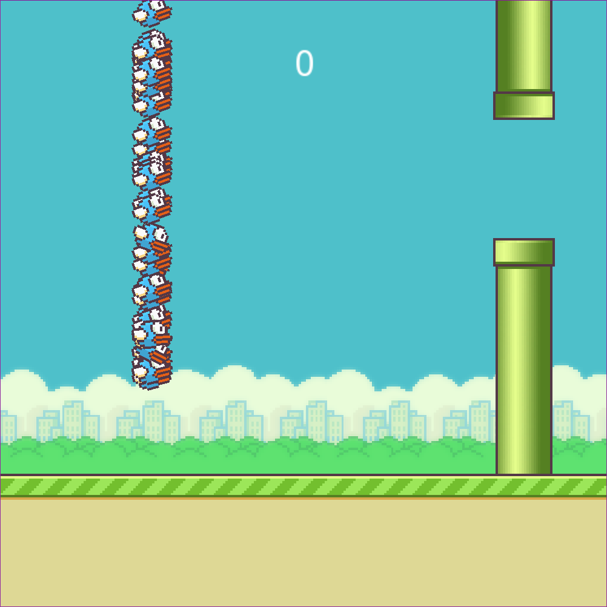

# FlappyBirdNN
An implementation of a simple neural network that learns to play flappy bird written in c++ using SFML. The neural network learns via an evolutionary method where 
the best ones move their "genes" to the next generation and then these genes are mutated slightly.

## How the Neural Network calculates the output
The Neural network uses ReLu as the activation function (max(0,value)), but other functions can be used.
```
bool NeuralNetwork::Calculate(double* input) {
	for (int i = 0; i < NumOfNodesInInput; i++) {
		layers[0][i] = input[i];							
	}

	for (int i = 0; i < NumOfNodesInHidden; i++) {			
		layers[1][i] = bias[0][i];							
		for (int j = 0; j < NumOfNodesInInput; j++) {
			layers[1][i] += layers[0][j] * inputW[i][j];	
		}
		layers[1][i] = activationFunc(layers[1][i]);
	}

	for (int k = 2; k < NumOfHiddenLayers + 1; k++) {						
		for (int i = 0; i < NumOfNodesInHidden; i++) {						
			layers[k][i] = bias[k - 1][i];									
			for (int j = 0; j < NumOfNodesInHidden; j++) {					
				layers[k][i] += layers[k - 1][j] * hiddenWs[k - 2][i][j];	
			}
			layers[k][i] = activationFunc(layers[k][i]);					
		}
	}

	for (int i = 0; i < NumOfNodesInOutput; i++) {													
		layers[NumOfHiddenLayers + 1][i] = bias[NumOfHiddenLayers][i];								
		for (int j = 0; j < NumOfNodesInHidden; j++) {
			layers[NumOfHiddenLayers + 1][i] += layers[NumOfHiddenLayers][j] * outputW[i][j];		
		}
		layers[NumOfHiddenLayers + 1][i] = activationFunc(layers[NumOfHiddenLayers + 1][i]);		
	}

	return layers[NumOfHiddenLayers + 1][0] > layers[NumOfHiddenLayers + 1][1];
}
```

## Examples in game



