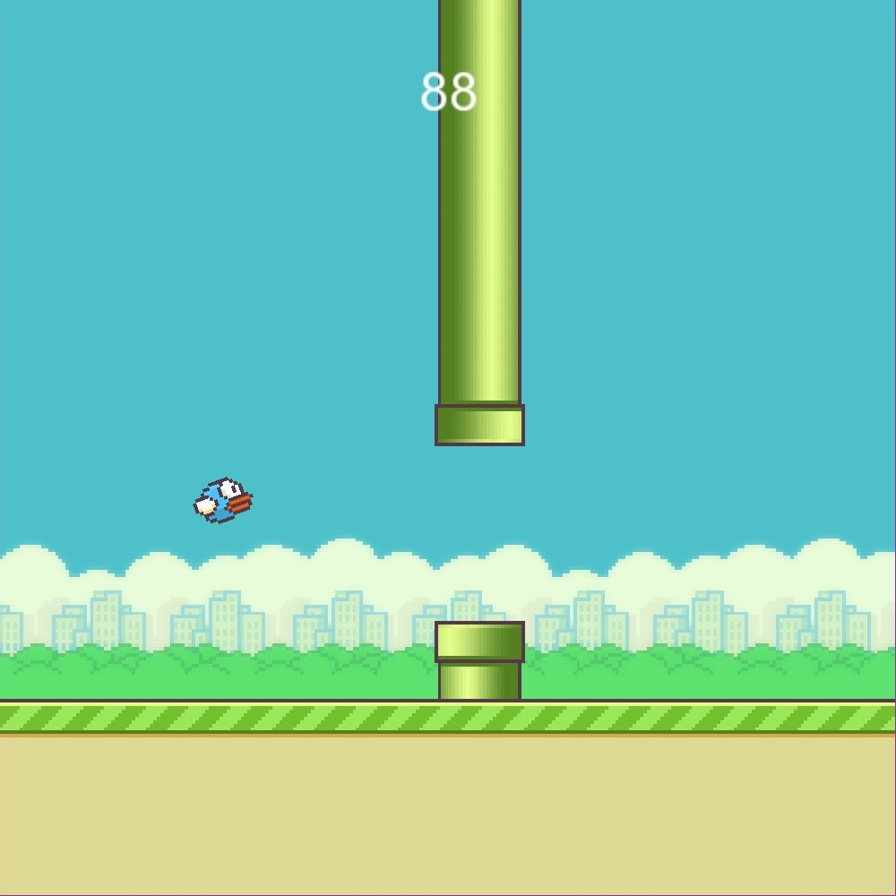

# FlappyBirdNN
An implementation of a simple neural network that learns to play flappy bird written in c++ using SFML. The neural network learns via an evolutionary method where 
the best ones move their "genes" to the next generation and then these genes are mutated slightly.
## Examples in game

